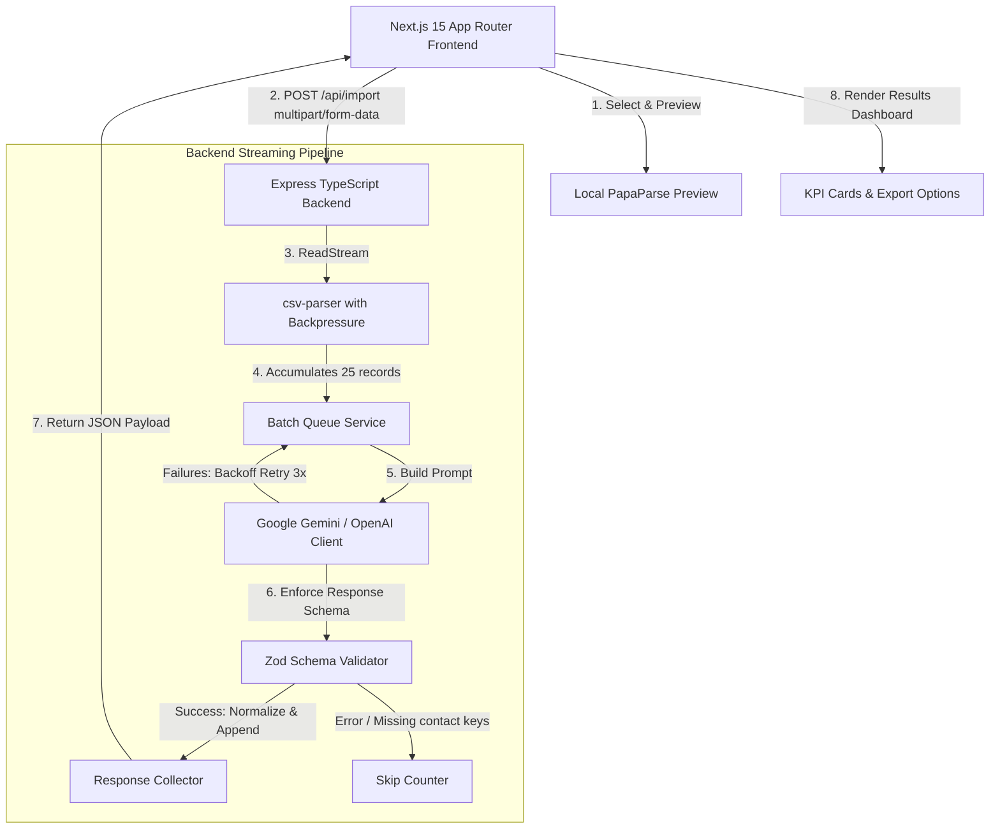

# GrowEasy AI-Powered Universal CRM CSV Importer

An intelligent, production-ready, full-stack application designed to parse, map, and import messy CSV files from arbitrary lead sources (such as Facebook Lead Ads, Google Ads, Real Estate CRMs, Excel spreadsheets, etc.) into the standardized GrowEasy CRM target schema using Large Language Models (Gemini/OpenAI).

---

## Architecture Overview



---

## Key Features

- **Headerless CSV Support**: Accepts CSVs with arbitrary column headers (e.g. maps "Contact Person", "Customer Name", "Contact Name" automatically to "name").
- **Backpressure-Aware Streaming**: Never loads full CSV contents into RAM, supporting 100,000+ rows efficiently.
- **Strict Data Validation & Cleanups**:
  - Automatically extracts country codes (e.g., `+91`) and isolates mobile digits.
  - Dedupes multiple email/phone numbers, assigning the first to primary columns and appending the rest to notes.
  - Normalizes custom dates to strict ISO format.
  - Standardizes status enums (`GOOD_LEAD_FOLLOW_UP`, `DID_NOT_CONNECT`, etc.) and campaign sources.
- **Sleek Glassmorphic Dashboard**: Light/Dark responsive UI featuring:
  - TanStack pagination, sorting, and search for previews and mapped outputs.
  - Framer Motion micro-animations.
  - Stages progress monitor showing upload, parse, and AI processing metrics.
  - Quick export hooks (JSON & CSV).

---

## Directory Structure

```text
groweasy-proj
├── backend
│   ├── src
│   │   ├── ai            # Reusable Prompt Builder
│   │   ├── controllers   # Import endpoint orchestrators
│   │   ├── parser        # Streaming CSV backpressure logic
│   │   ├── routes        # API endpoints and upload limits config
│   │   ├── services      # OpenAI/Gemini SDK integrations
│   │   ├── types         # Target CRM type models
│   │   ├── utils         # Utilities
│   │   └── validators    # Zod validation and transform schemas
│   ├── tests             # Jest unit and integration tests
│   ├── Dockerfile
│   └── tsconfig.json
├── frontend
│   ├── src
│   │   ├── app           # Next.js 15 App router (Layouts, Styles)
│   │   ├── components    # Dropzones, Previews, Dashboard modules
│   │   └── services      # Axios HTTP client requests
│   ├── Dockerfile
│   └── package.json
├── docker-compose.yml
└── README.md
```

---

## Environment Variables

### Backend (`backend/.env`)

| Key | Description | Default / Example |
| :--- | :--- | :--- |
| `PORT` | Local express port | `5000` |
| `NODE_ENV` | Mode of deployment | `development` |
| `CORS_ORIGIN` | Allowed client URL | `http://localhost:3000` |
| `AI_PROVIDER` | LLM service provider (`gemini` or `openai`) | `gemini` |
| `GEMINI_API_KEY`| Google Gemini api key | `AIzaSy...` |
| `OPENAI_API_KEY`| OpenAI api key | `sk-proj-...` |
| `RATE_LIMIT_WINDOW_MS`| Rate limiter window (15 mins) | `900000` |
| `RATE_LIMIT_MAX` | Max uploads per rate limit window | `100` |

### Frontend (`frontend/.env.local`)

| Key | Description | Default / Example |
| :--- | :--- | :--- |
| `NEXT_PUBLIC_API_URL` | Base URL of the running backend | `http://localhost:5000/api` |

---

## Local Setup

### Setup with Docker Compose (Recommended)

1. Make sure Docker is running on your host system.
2. Build and start both services:
   ```bash
   docker-compose up --build
   ```
3. The frontend is accessible at `http://localhost:3000` and backend is running at `http://localhost:5000`.

### Manual Setup (Development Mode)

#### 1. Start the Backend
```bash
cd backend
npm install
# Create backend/.env and populate your GEMINI_API_KEY or OPENAI_API_KEY
npm run dev
```

#### 2. Start the Frontend
```bash
cd frontend
npm install
npm run dev
```
Open `http://localhost:3000` in your web browser.

---

## Running Tests

Run Jest unit and integration tests inside the backend directory:
```bash
cd backend
npm test
```

---

## API Specifications

### POST `/api/import`
Accepts a single CSV file, parses and maps it using LLMs, and returns the standardized JSON records.

- **Request Format**: `multipart/form-data`
- **Field Name**: `csv`
- **Max File Size**: `20 MB`

#### Example Response (Success)
```json
{
  "success": true,
  "totalRows": 500,
  "imported": 482,
  "skipped": 18,
  "failedBatches": 0,
  "records": [
    {
      "created_at": "2024-05-24T12:00:00.000Z",
      "name": "Jane Doe",
      "email": "jane@example.com",
      "country_code": "+91",
      "mobile_without_country_code": "9876543210",
      "company": "GrowEasy",
      "city": "Bangalore",
      "state": "Karnataka",
      "country": "India",
      "lead_owner": "Sales Team",
      "crm_status": "GOOD_LEAD_FOLLOW_UP",
      "crm_note": "Interested in premium tier. Secondary Email: jane.backup@example.com",
      "data_source": "leads_on_demand",
      "possession_time": "Immediate",
      "description": "Meta advertising lead"
    }
  ]
}
```

---

## Prompt Engineering & AI Architecture

1. **System Prompt Builder**: Generates static mapping instructions enforcing the GrowEasy schema format, strict data normalizations, status mappings, and skip instructions.
2. **Structured JSON Output**:
   - **Google Gemini**: Uses `responseMimeType: "application/json"` with `responseSchema` defining the type-safe structure.
   - **OpenAI**: Enforces strict JSON Schema parameters through `response_format: { type: "json_schema" }`.
3. **Exponential Backoff Retries**: If the LLM throws a rate limit error or network exception, the batch is retried up to 3 times with exponential backoff delays ($1\text{s} \to 2\text{s} \to 4\text{s}$).

---

## Deployment Guides

### Frontend (Vercel)
1. Link your repository on Vercel.
2. Configure Environment Variable:
   - `NEXT_PUBLIC_API_URL` = (URL of your deployed backend)
3. Deploy.

### Backend (Railway / Render / AWS)
1. Select Node.js runner or Docker build file.
2. Define environment properties: `AI_PROVIDER`, `GEMINI_API_KEY` (or `OPENAI_API_KEY`), and `CORS_ORIGIN` (URL of Vercel app).
3. Deploy.
